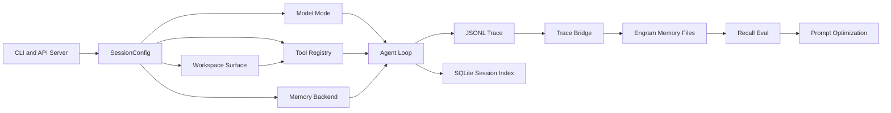

# Engram Harness Architecture

This is the current high-level map for contributors.



## Runtime Flow

`harness.cli` and `harness.server` both build a `SessionConfig`, construct a
model mode, memory backend, tool registry, tracer, stream sink, and lane
registry, then enter `harness.loop.run` or `run_until_idle`.

The loop is the dispatch boundary: model calls produce tool calls, mutating tool
batches run sequentially, read-only batches can run in parallel, tool outputs
are wrapped/truncated, and usage is priced. Pause/resume, compaction, adaptive
recall, repetition guards, and trace events all live there.

## Memory and Workspace

`EngramMemory` is the governed memory backend. It bootstraps compact context,
serves recall, buffers session records, and exposes snapshots for the trace
bridge. `workspace/` is the ungoverned working surface for threads, notes,
projects, and plans. Work tools write there; promotion into Engram remains
explicit.

## Server Boundary

The API server defaults to `no_shell`, rejects `full` unless
`HARNESS_SERVER_ALLOW_FULL_TOOLS=1`, and should be run with
`HARNESS_API_TOKEN` plus `HARNESS_WORKSPACE_ROOT` outside loopback-only local
development. Resource controls are:

- `HARNESS_SERVER_MAX_ACTIVE_SESSIONS`
- `HARNESS_SERVER_SSE_QUEUE_MAXSIZE`
- `HARNESS_SERVER_INTERACTIVE_IDLE_TIMEOUT_SECS`

## Quality Gates

Run these before opening a PR:

```bash
python -m ruff check harness conftest.py
python -m ruff format --check harness conftest.py
python -m pytest harness/tests/ -v
harness recall-eval --really-run
```

Use `pip install -e ".[dev,api]"` for server tests and
`python -m pytest harness/tests/ --integration -v` for the integration suite.
