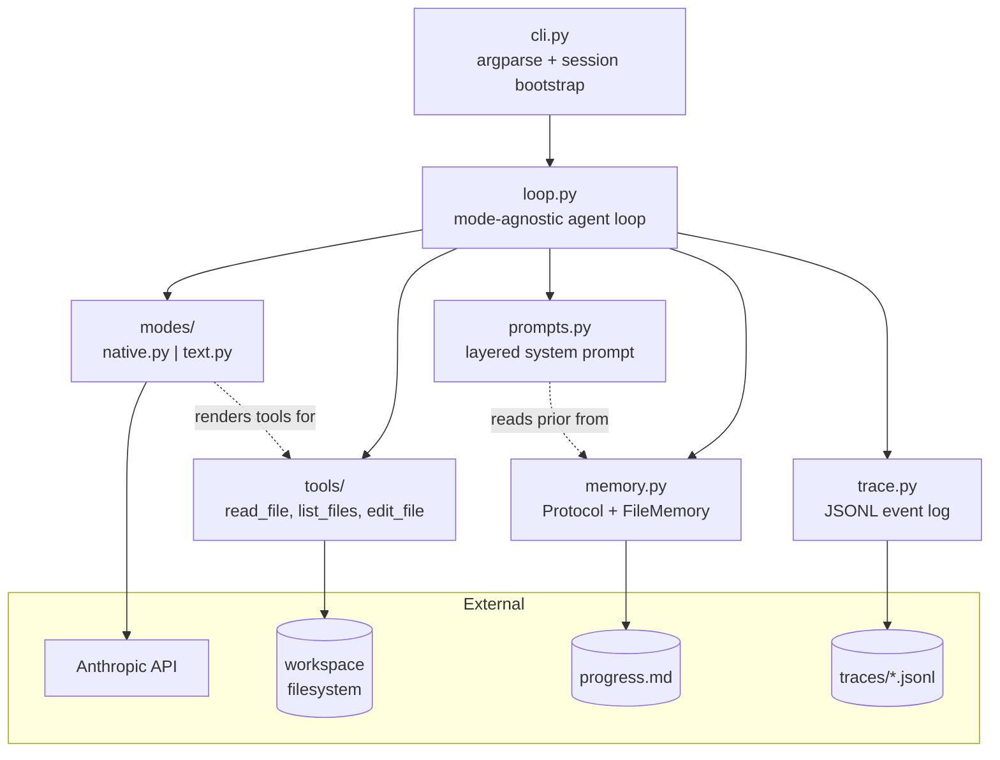
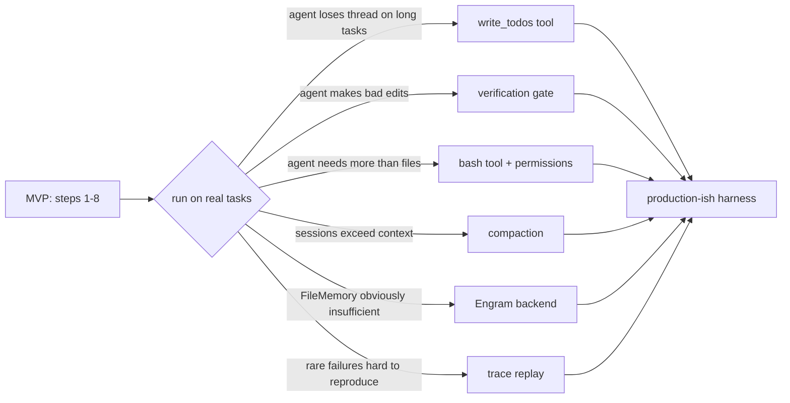

# Agent Harness Roadmap

A build plan for a pedagogical agent harness in Python. Two tool-call modes (text-parsed and native API), three filesystem tools, a file-based `progress.md` as the first memory backend, structured JSONL tracing, and a memory `Protocol` designed so Engram can replace the file-based implementation later without touching the loop.

Target: **~400–500 lines**, one weekend to first working version, plus an open-ended "beyond" section for what to add only after you've observed failures.

---

## Guiding principles

Five things to keep in mind throughout. They're the synthesis of the four posts you fed me plus the posture I think makes this project worth doing.

1. **The loop is trivial. The scaffolding is the product.** The ~50 lines of loop will work on day one. Everything interesting — tool design, context shape, error handling, memory — lives around it.
2. **Build the minimum, then resist adding anything until you see it fail.** Manus rewrote five times; each rewrite *removed* complexity. Pre-designing ideal configurations before real failures is the #1 anti-pattern.
3. **Tool design is prompt design.** The name, description, parameter names, and error messages of every tool are part of your system prompt. If the model misuses a tool, change the tool first, not the prompt.
4. **Errors in context are learning signal.** Don't catch-and-summarize tool errors. Surface the traceback. The model updates its beliefs from what it sees failing.
5. **Memory is a seam, not an implementation.** The `Protocol` is the contract with future-you. First impl is dumb on purpose. Engram slots in later.

---

## Architecture at a glance



The thing to notice: `loop.py` depends on abstractions (`Mode`, `Tool`, `MemoryBackend`, `Tracer`), not on concrete implementations. That's what makes the text/native toggle clean and what lets Engram replace `FileMemory` later.

---

## The core loop, visualized

```mermaid
sequenceDiagram
    participant User
    participant CLI as cli.py
    participant Loop as loop.py
    participant Mem as memory
    participant Mode as mode (native/text)
    participant LLM as Anthropic API
    participant Tool as tool executor
    participant Trace as tracer

    User->>CLI: python -m harness "task" --mode native
    CLI->>Mem: start_session(task)
    Mem-->>CLI: prior context (progress.md contents)
    CLI->>Loop: run(task, mode, tools, memory, tracer)
    Loop->>Mode: initial_messages(task, prior, tools)
    Mode-->>Loop: messages[]

    loop until no tool calls or max_turns
        Loop->>Mode: complete(messages)
        Mode->>LLM: messages.create(...)
        LLM-->>Mode: response
        Mode-->>Loop: response
        Loop->>Trace: event("model_response")
        Loop->>Mode: extract_tool_calls(response)
        alt tool calls present
            Mode-->>Loop: [ToolCall, ...]
            Loop->>Tool: execute(call)
            Tool-->>Loop: ToolResult
            Loop->>Trace: event("tool_result")
            Loop->>Mem: record on error
            Loop->>Mode: as_tool_results_message(results)
        else no tool calls
            Mode-->>Loop: []
            Loop->>Mem: end_session(summary)
            Loop->>Trace: event("session_end")
            Loop-->>CLI: final response
        end
    end

    CLI-->>User: final text + trace path
```

---

## File layout

```
harness/
├── __init__.py
├── __main__.py          # enables `python -m harness`
├── loop.py              # the core loop, mode-agnostic
├── modes/
│   ├── __init__.py
│   ├── base.py          # Mode Protocol
│   ├── native.py        # Anthropic native tool-use API
│   └── text.py          # 'tool: name({...})' parsing
├── tools/
│   ├── __init__.py      # Tool Protocol, registry, execute()
│   └── fs.py            # read_file, list_files, edit_file
├── memory.py            # MemoryBackend Protocol + FileMemory
├── prompts.py           # layered system prompt assembly
├── trace.py             # JSONL event logger
└── cli.py               # argparse, workspace/session bootstrap
pyproject.toml
README.md
.gitignore               # progress.md, traces/, .env
```

---

## The 8 steps (weekend plan)

### Step 1 — `memory.py`: Protocol first, impl second

**Why first:** This is the one architectural bet. Write it before anything else so the rest of the code can't help but honor the contract.

```python
# harness/memory.py
from __future__ import annotations
from dataclasses import dataclass
from datetime import datetime
from pathlib import Path
from typing import Protocol, runtime_checkable


@dataclass
class Memory:
    content: str
    timestamp: datetime
    kind: str  # "note", "error", "decision", "summary", ...


@runtime_checkable
class MemoryBackend(Protocol):
    """The contract. FileMemory honors it naively; Engram will honor it properly."""

    def start_session(self, task: str) -> str:
        """Return prior context to seed the session. May be empty."""

    def recall(self, query: str, k: int = 5) -> list[Memory]:
        """Query-based retrieval. FileMemory ignores the query; that's the point."""

    def record(self, content: str, kind: str = "note") -> None:
        """Capture an observation during the session."""

    def end_session(self, summary: str) -> None:
        """Wrap up. Persist whatever needs persisting."""


class FileMemory:
    """Dumb on purpose. One markdown file, appended to forever."""

    def __init__(self, path: Path):
        self.path = path
        self.path.touch(exist_ok=True)
        self._buffered_records: list[str] = []

    def start_session(self, task: str) -> str:
        existing = self.path.read_text()
        stamp = datetime.now().isoformat(timespec="seconds")
        self._append(f"\n## Session {stamp}\n**Task:** {task}\n\n")
        return existing

    def recall(self, query: str, k: int = 5) -> list[Memory]:
        # Honest: we have no notion of query here. Return nothing.
        # This is the exact gap Engram fills.
        return []

    def record(self, content: str, kind: str = "note") -> None:
        stamp = datetime.now().isoformat(timespec="seconds")
        self._append(f"- `{stamp}` [{kind}] {content}\n")

    def end_session(self, summary: str) -> None:
        self._append(f"\n**Summary:** {summary}\n")

    def _append(self, text: str) -> None:
        with self.path.open("a") as f:
            f.write(text)
```

**Test it:**
```python
from pathlib import Path
from harness.memory import FileMemory
m = FileMemory(Path("progress.md"))
prior = m.start_session("refactor utils.py")
m.record("read utils.py, 142 lines", kind="note")
m.record("ImportError on line 12", kind="error")
m.end_session("replaced os.path with pathlib throughout")
```

Look at `progress.md`. That's your whole memory system. It's enough to feel what's missing.

---

### Step 2 — `tools/`: three tools, shared abstraction

```python
# harness/tools/__init__.py
from __future__ import annotations
from dataclasses import dataclass, field
from typing import Any, Protocol


@dataclass
class ToolCall:
    name: str
    args: dict[str, Any]
    id: str | None = None  # native mode sets this; text mode leaves it None


@dataclass
class ToolResult:
    call: ToolCall
    content: str
    is_error: bool = False


class Tool(Protocol):
    name: str
    description: str
    input_schema: dict

    def run(self, args: dict) -> str: ...


def execute(call: ToolCall, registry: dict[str, Tool]) -> ToolResult:
    """Single point of execution. Errors become results, never exceptions."""
    tool = registry.get(call.name)
    if tool is None:
        return ToolResult(
            call=call,
            content=f"Unknown tool: {call.name}. Available: {sorted(registry)}",
            is_error=True,
        )
    try:
        content = tool.run(call.args)
        return ToolResult(call=call, content=content, is_error=False)
    except Exception as e:
        import traceback
        return ToolResult(
            call=call,
            content=f"{type(e).__name__}: {e}\n\n{traceback.format_exc()}",
            is_error=True,
        )
```

Errors-as-results is the single most important line of this file. Ball's Go version does this too (it flips a boolean on the `NewToolResultBlock`). Eric's Python version doesn't, and it's a real weakness of the tutorial.

```python
# harness/tools/fs.py
from __future__ import annotations
from dataclasses import dataclass
from pathlib import Path


@dataclass
class WorkspaceScope:
    """Confines all filesystem ops to one directory. Prevents 'read_file /etc/passwd'."""
    root: Path

    def resolve(self, relative: str) -> Path:
        p = (self.root / relative).resolve()
        if self.root.resolve() not in p.parents and p != self.root.resolve():
            raise ValueError(f"path {relative!r} escapes workspace {self.root}")
        return p


class ReadFile:
    name = "read_file"
    description = (
        "Read the full contents of a text file at a path relative to the workspace. "
        "Returns the file contents. Do not use on directories."
    )
    input_schema = {
        "type": "object",
        "properties": {
            "path": {"type": "string", "description": "Relative path within workspace."}
        },
        "required": ["path"],
    }

    def __init__(self, scope: WorkspaceScope):
        self.scope = scope

    def run(self, args: dict) -> str:
        path = self.scope.resolve(args["path"])
        return path.read_text(encoding="utf-8")


class ListFiles:
    name = "list_files"
    description = (
        "List files and directories at a path relative to the workspace. "
        "Directories are suffixed with a trailing slash. Defaults to workspace root."
    )
    input_schema = {
        "type": "object",
        "properties": {
            "path": {"type": "string", "description": "Relative path. Defaults to '.'."}
        },
    }

    def __init__(self, scope: WorkspaceScope):
        self.scope = scope

    def run(self, args: dict) -> str:
        path = self.scope.resolve(args.get("path", "."))
        entries = []
        for item in sorted(path.iterdir()):
            entries.append(item.name + ("/" if item.is_dir() else ""))
        return "\n".join(entries) if entries else "(empty directory)"


class EditFile:
    name = "edit_file"
    description = (
        "Edit a text file by replacing `old_str` with `new_str`. "
        "If the file does not exist AND `old_str` is empty, the file is created with `new_str`. "
        "`old_str` must match exactly and appear exactly once. "
        "`old_str` and `new_str` must differ."
    )
    input_schema = {
        "type": "object",
        "properties": {
            "path": {"type": "string"},
            "old_str": {"type": "string", "description": "Exact text to replace. Empty = create file."},
            "new_str": {"type": "string", "description": "Replacement text."},
        },
        "required": ["path", "old_str", "new_str"],
    }

    def __init__(self, scope: WorkspaceScope):
        self.scope = scope

    def run(self, args: dict) -> str:
        path = self.scope.resolve(args["path"])
        old, new = args["old_str"], args["new_str"]
        if old == new:
            raise ValueError("old_str and new_str must differ")

        if not path.exists():
            if old != "":
                raise FileNotFoundError(f"{path.name} does not exist; pass empty old_str to create")
            path.write_text(new, encoding="utf-8")
            return f"created {path.name}"

        content = path.read_text(encoding="utf-8")
        occurrences = content.count(old)
        if occurrences == 0:
            raise ValueError(f"old_str not found in {path.name}")
        if occurrences > 1:
            raise ValueError(f"old_str appears {occurrences} times in {path.name}; must be unique")
        path.write_text(content.replace(old, new, 1), encoding="utf-8")
        return f"edited {path.name}"
```

Two decisions worth naming. **Uniqueness on `edit_file`** — the tool refuses ambiguous matches. Claude Code does this and it eliminates a whole class of "wrong line edited" failures. **Descriptions are written for the model, not for humans.** They say exactly what the tool does, what the inputs mean, and what the edge cases are. That's the prompt.

---

### Step 3 — `trace.py`: JSONL from day one

```python
# harness/trace.py
from __future__ import annotations
import json
from datetime import datetime
from pathlib import Path
from typing import Any


class Tracer:
    """One JSONL file per session. No viewer; use jq."""

    def __init__(self, path: Path):
        path.parent.mkdir(parents=True, exist_ok=True)
        self.path = path
        self._f = path.open("a", buffering=1)  # line-buffered

    def event(self, kind: str, **data: Any) -> None:
        record = {
            "ts": datetime.now().isoformat(timespec="milliseconds"),
            "kind": kind,
            **data,
        }
        self._f.write(json.dumps(record, default=str) + "\n")

    def close(self) -> None:
        self._f.close()

    def __enter__(self):
        return self

    def __exit__(self, *exc):
        self.close()
```

When something weird happens in a session, `jq 'select(.kind == "tool_result") | .result.is_error' traces/*.jsonl` is how you find it.

---

### Step 4 — `modes/native.py` first

Native is easier because the SDK does the formatting. Write it first, get a working loop, then do text to feel what the SDK is hiding.

```python
# harness/modes/base.py
from __future__ import annotations
from typing import Any, Protocol

from harness.tools import Tool, ToolCall, ToolResult


class Mode(Protocol):
    """Abstracts over tool-call representation. Native uses the API; text parses strings."""

    def initial_messages(self, task: str, prior: str, tools: dict[str, Tool]) -> list[dict]:
        ...

    def complete(self, messages: list[dict]) -> Any:
        """Call the model. Return provider-native response object."""

    def as_assistant_message(self, response: Any) -> dict:
        """Serialize response for the next turn's messages list."""

    def extract_tool_calls(self, response: Any) -> list[ToolCall]:
        ...

    def as_tool_results_message(self, results: list[ToolResult]) -> dict:
        ...

    def final_text(self, response: Any) -> str:
        """Plain-text summary for end_session."""
```

```python
# harness/modes/native.py
from __future__ import annotations
import anthropic

from harness.tools import Tool, ToolCall, ToolResult
from harness.prompts import system_prompt_native


class NativeMode:
    def __init__(self, client: anthropic.Anthropic, model: str, tools: dict[str, Tool]):
        self.client = client
        self.model = model
        self.tools = tools
        self._system = system_prompt_native()
        self._tool_schemas = [
            {
                "name": t.name,
                "description": t.description,
                "input_schema": t.input_schema,
            }
            for t in tools.values()
        ]

    def initial_messages(self, task: str, prior: str, tools: dict[str, Tool]) -> list[dict]:
        user = task if not prior.strip() else (
            f"Prior session notes (for context; may be stale):\n\n{prior}\n\n---\n\n{task}"
        )
        return [{"role": "user", "content": user}]

    def complete(self, messages: list[dict]):
        return self.client.messages.create(
            model=self.model,
            max_tokens=4096,
            system=self._system,
            tools=self._tool_schemas,
            messages=messages,
        )

    def as_assistant_message(self, response) -> dict:
        return {"role": "assistant", "content": response.content}

    def extract_tool_calls(self, response) -> list[ToolCall]:
        calls = []
        for block in response.content:
            if block.type == "tool_use":
                calls.append(ToolCall(name=block.name, args=block.input, id=block.id))
        return calls

    def as_tool_results_message(self, results: list[ToolResult]) -> dict:
        return {
            "role": "user",
            "content": [
                {
                    "type": "tool_result",
                    "tool_use_id": r.call.id,
                    "content": r.content,
                    "is_error": r.is_error,
                }
                for r in results
            ],
        }

    def final_text(self, response) -> str:
        return "".join(b.text for b in response.content if b.type == "text")
```

---

### Step 5 — `loop.py`: wire it together

```python
# harness/loop.py
from __future__ import annotations
from harness.memory import MemoryBackend
from harness.modes.base import Mode
from harness.tools import Tool, execute
from harness.trace import Tracer


def run(
    task: str,
    mode: Mode,
    tools: dict[str, Tool],
    memory: MemoryBackend,
    tracer: Tracer,
    max_turns: int = 50,
) -> str:
    prior = memory.start_session(task)
    messages = mode.initial_messages(task=task, prior=prior, tools=tools)
    tracer.event("session_start", task=task)

    for turn in range(max_turns):
        response = mode.complete(messages)
        tracer.event("model_response", turn=turn)
        messages.append(mode.as_assistant_message(response))

        tool_calls = mode.extract_tool_calls(response)
        if not tool_calls:
            final = mode.final_text(response)
            memory.end_session(summary=final[:500])
            tracer.event("session_end", turns=turn + 1)
            return final

        results = []
        for call in tool_calls:
            tracer.event("tool_call", name=call.name, args=call.args)
            result = execute(call, tools)
            tracer.event("tool_result", name=call.name, is_error=result.is_error,
                         content_preview=result.content[:200])
            results.append(result)
            if result.is_error:
                memory.record(f"{call.name} failed: {result.content[:200]}", kind="error")

        messages.append(mode.as_tool_results_message(results))

    tracer.event("session_end", turns=max_turns, reason="max_turns")
    memory.end_session(summary="(max turns reached)")
    return "(max turns reached without completion)"
```

---

### Step 6 — `cli.py`: the thinnest possible frontend

```python
# harness/cli.py
from __future__ import annotations
import argparse
import os
from datetime import datetime
from pathlib import Path

import anthropic

from harness.loop import run
from harness.memory import FileMemory
from harness.tools import Tool
from harness.tools.fs import EditFile, ListFiles, ReadFile, WorkspaceScope
from harness.trace import Tracer


def build_tools(scope: WorkspaceScope) -> dict[str, Tool]:
    return {t.name: t for t in [ReadFile(scope), ListFiles(scope), EditFile(scope)]}


def main() -> None:
    parser = argparse.ArgumentParser(prog="harness")
    parser.add_argument("task", help="What you want the agent to do.")
    parser.add_argument("--workspace", default=".", help="Directory the agent may read/write.")
    parser.add_argument("--mode", choices=["native", "text"], default="native")
    parser.add_argument("--model", default="claude-sonnet-4-5")
    parser.add_argument("--max-turns", type=int, default=50)
    args = parser.parse_args()

    workspace = Path(args.workspace).resolve()
    scope = WorkspaceScope(root=workspace)
    tools = build_tools(scope)

    memory = FileMemory(path=workspace / "progress.md")
    trace_path = Path("traces") / f"{datetime.now():%Y%m%d-%H%M%S}-{args.mode}.jsonl"

    client = anthropic.Anthropic()  # ANTHROPIC_API_KEY from env

    if args.mode == "native":
        from harness.modes.native import NativeMode
        mode = NativeMode(client=client, model=args.model, tools=tools)
    else:
        from harness.modes.text import TextMode
        mode = TextMode(client=client, model=args.model, tools=tools)

    with Tracer(trace_path) as tracer:
        final = run(args.task, mode, tools, memory, tracer, max_turns=args.max_turns)

    print("\n" + "=" * 60)
    print(final)
    print("=" * 60)
    print(f"trace: {trace_path}")
    print(f"progress: {workspace / 'progress.md'}")
```

```python
# harness/__main__.py
from harness.cli import main

if __name__ == "__main__":
    main()
```

At this point you can:

```bash
python -m harness "create hello.py that prints the current date" \
  --workspace ./scratch --mode native
```

Watch it work. Look at `progress.md`. `cat traces/*.jsonl | jq .kind`.

---

### Step 7 — Run it on something real

Pick a task that's barely too big. Suggestions, in order of increasing ambition:

1. "Read all `.py` files in `src/` and write a one-paragraph summary of the project to `SUMMARY.md`."
2. "Add type hints to every function in `utils.py`."
3. "There's a bug in `parser.py` — when input is empty it crashes. Find and fix it, and write a test that would have caught it."

Then read the trace. Not the final output — the *trace*. Look at what tools got called, in what order, what errors came up, how the model recovered (or didn't). The thing you're training is your eye for which failures are fixable by prompt, which by tool design, and which by adding infrastructure.

---

### Step 8 — Now build `modes/text.py`

With a working native mode, porting to text is a study in what the SDK was doing for you.

```python
# harness/modes/text.py
from __future__ import annotations
import json
import re
import anthropic

from harness.tools import Tool, ToolCall, ToolResult
from harness.prompts import system_prompt_text


_TOOL_LINE = re.compile(r"^tool:\s*(\w+)\s*\((.*)\)\s*$")


class TextMode:
    """Eric's approach: tools are described in the system prompt; responses are parsed."""

    def __init__(self, client: anthropic.Anthropic, model: str, tools: dict[str, Tool]):
        self.client = client
        self.model = model
        self.tools = tools
        self._system = system_prompt_text(tools)

    def initial_messages(self, task: str, prior: str, tools: dict[str, Tool]) -> list[dict]:
        user = task if not prior.strip() else (
            f"Prior session notes:\n\n{prior}\n\n---\n\n{task}"
        )
        return [{"role": "user", "content": user}]

    def complete(self, messages: list[dict]):
        return self.client.messages.create(
            model=self.model,
            max_tokens=4096,
            system=self._system,
            messages=messages,  # no `tools` arg — that's the whole point
        )

    def as_assistant_message(self, response) -> dict:
        text = "".join(b.text for b in response.content if b.type == "text")
        return {"role": "assistant", "content": text}

    def extract_tool_calls(self, response) -> list[ToolCall]:
        text = "".join(b.text for b in response.content if b.type == "text")
        calls = []
        for line in text.splitlines():
            m = _TOOL_LINE.match(line.strip())
            if not m:
                continue
            name, raw_args = m.group(1), m.group(2)
            try:
                args = json.loads(raw_args)
            except json.JSONDecodeError:
                continue
            calls.append(ToolCall(name=name, args=args, id=None))
        return calls

    def as_tool_results_message(self, results: list[ToolResult]) -> dict:
        lines = []
        for r in results:
            status = "error" if r.is_error else "ok"
            lines.append(f"tool_result({r.call.name}, {status}): {r.content}")
        return {"role": "user", "content": "\n".join(lines)}

    def final_text(self, response) -> str:
        return "".join(b.text for b in response.content if b.type == "text")
```

And the system prompt for text mode lives in `prompts.py`:

```python
# harness/prompts.py
from __future__ import annotations
from harness.tools import Tool


_IDENTITY = """You are a coding assistant operating on a local workspace via tools. \
You work one step at a time, verify your changes, and prefer small precise edits over large rewrites."""

_RULES = """Rules:
- Read before you edit. Always inspect a file's current contents before editing it.
- Use exact strings in edit_file.old_str. If it fails, re-read the file and try again.
- If you don't know, say so. Do not invent file contents."""

_OUTPUT_NATIVE = """When you are done, respond with a plain-text summary of what you did."""

_OUTPUT_TEXT = """To call a tool, emit EXACTLY one line:
    tool: TOOL_NAME({"arg": "value"})
Use compact JSON with double quotes. No prose on tool-call lines.
When you are done, respond with a plain-text summary and no tool lines."""


def _render_tool(tool: Tool) -> str:
    import json
    schema = json.dumps(tool.input_schema, indent=2)
    return f"### {tool.name}\n{tool.description}\n\nInput schema:\n```json\n{schema}\n```"


def system_prompt_native() -> str:
    return f"{_IDENTITY}\n\n{_RULES}\n\n{_OUTPUT_NATIVE}"


def system_prompt_text(tools: dict[str, Tool]) -> str:
    tool_docs = "\n\n".join(_render_tool(t) for t in tools.values())
    return f"{_IDENTITY}\n\n## Tools\n\n{tool_docs}\n\n{_RULES}\n\n{_OUTPUT_TEXT}"
```

Run the same task you ran in Step 7, now with `--mode text`. Compare the traces side by side. The interesting things to notice:

- How much *longer* the text-mode system prompt is.
- Whether the text-mode agent ever emits malformed tool lines (it will, occasionally).
- Whether the two modes pick the same tools in the same order (often, but not always).
- Token usage per turn.

This is the part no tutorial gives you. You're looking at the raw mechanism (a wink, as Ball says) next to the SDK's polished version, doing the same job.

---

## Beyond the weekend

Everything below is in **failure-driven** order. Don't add any of it until you've seen the corresponding failure in a real trace.



### Failure → Response pairings

| Failure you'll see | What to add | Lesson source |
|---|---|---|
| Agent forgets what it was doing mid-session | `write_todos` tool + encourage its use in system prompt | Manus lesson 4 (task recitation) |
| Agent declares "done" when it isn't | Pre-completion verification gate (re-read, run tests) | LangChain DeepAgents |
| Agent wants to `grep` / run tests / git status | `bash` tool, with a permission tier (safe/moderate/dangerous) | Gitbook Stage 4 |
| Session hits max tokens before finishing | Context compaction: summarize older turns, keep recent verbatim | Anthropic long-running post |
| `progress.md` is 2000 lines and useless | Engram backend: the `MemoryBackend` swap you designed for | Your own project |
| Weird one-off failure, hard to reproduce | Trace replay + deterministic mode (seed, mock LLM) | Every eval harness ever |
| You want to try a second task type and the prompt is a mess | Split prompts into named layers, add task-specific layer | Gitbook Stage 3 |

### A specific sketch for `write_todos` (first thing you'll probably add)

```python
# harness/tools/planning.py  — when you need it
class WriteTodos:
    name = "write_todos"
    description = (
        "Write or overwrite the TODO list for the current task. "
        "Use this at the start of complex tasks to plan, and update it as you make progress. "
        "The file is at .todos.md in the workspace."
    )
    input_schema = {
        "type": "object",
        "properties": {
            "todos": {
                "type": "array",
                "items": {
                    "type": "object",
                    "properties": {
                        "content": {"type": "string"},
                        "status": {"type": "string", "enum": ["todo", "doing", "done"]},
                    },
                    "required": ["content", "status"],
                },
            },
        },
        "required": ["todos"],
    }

    def __init__(self, scope: WorkspaceScope):
        self.scope = scope

    def run(self, args: dict) -> str:
        path = self.scope.resolve(".todos.md")
        lines = []
        for todo in args["todos"]:
            mark = {"todo": "[ ]", "doing": "[~]", "done": "[x]"}[todo["status"]]
            lines.append(f"- {mark} {todo['content']}")
        path.write_text("\n".join(lines) + "\n", encoding="utf-8")
        return f"wrote {len(args['todos'])} todos"
```

### A sketch for the Engram swap

When you're ready, the swap looks like:

```python
# harness/memory.py  — additional impl, FileMemory stays
class EngramMemory:
    def __init__(self, engram_client, repo_path: Path, session_tag: str):
        self.engram = engram_client
        self.repo_path = repo_path
        self.session_tag = session_tag

    def start_session(self, task: str) -> str:
        # Pull trust-weighted, temporally-decayed memories relevant to the task
        memories = self.engram.query(task, top_k=10, tags=["coding"])
        return "\n\n".join(m.render() for m in memories)

    def recall(self, query: str, k: int = 5) -> list[Memory]:
        return [Memory(content=m.content, timestamp=m.ts, kind=m.kind)
                for m in self.engram.query(query, top_k=k)]

    def record(self, content: str, kind: str = "note") -> None:
        self.engram.write(content=content, kind=kind, tags=[self.session_tag])

    def end_session(self, summary: str) -> None:
        self.engram.write(content=summary, kind="summary", tags=[self.session_tag])
        self.engram.commit(message=f"session {self.session_tag}")
```

And in `cli.py`, a `--memory {file,engram}` flag picks which backend gets constructed. The loop doesn't change at all. **That's the payoff of writing the Protocol first.**

---

## Development hygiene

- **`.gitignore`** should include `progress.md`, `traces/`, `.env`, `.todos.md`, and `scratch/`. The harness itself is the artifact; per-workspace state is not.
- **`pyproject.toml`** with one dependency (`anthropic`) and optionally `rich` for prettier terminal output. No frameworks.
- **`.env`** for `ANTHROPIC_API_KEY`. The SDK reads it from the environment automatically.
- **One scratch directory** under `./scratch/` or `./workspaces/` where you run the agent on throwaway tasks. Don't point the agent at its own source tree until you're confident in the scope checks.

---

## The North Star

This harness is not meant to become Claude Code. It's meant to be the thing you understand completely. When you read the next blog post about agent harnesses, or when you look at a bug in a real coding agent, or when you wire Engram into something, you want the muscle memory of "I know exactly what layer this is happening at."

Everything past the 8 steps is optional, and every addition should answer the question "what failure am I responding to?" If you can't answer that, don't add it.

Build it grubby. Run it often. Read the traces. The lessons are in the gap between what you intended and what the trace shows.
